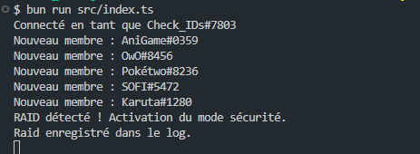
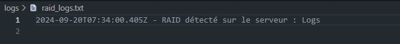

# Fluffy-Raidbot
bot de modération anti-raid pour Discord qui protéger un serveur contre les raids, qui sont des attaques coordonnées où un grand nombre de comptes rejoignent un serveur en très peu de temps dans l'objectif de semer le chaos.


## Description
Ce bot Discord est conçu pour protéger les serveurs contre les raids (attaques de masse) en détectant un afflux important de nouveaux membres et en verrouillant les salons texte publics pour empêcher le spam. 
Il détecte automatiquement un raid et active un mode de sécurité qui désactive l'envoi de messages dans les salons. Après un certain délai (Fixé de base à 30 minutes), le mode de protection est désactivé et les salons sont rétablis à la normale.

## Fonctionnalités
- Détection de raid : Surveille le nombre de nouveaux membres rejoignant le serveur sur une courte période.
- Mode anti-raid : Verrouille les salons texte publics pour limiter les dégâts en cas de raid.
- Système de logs : Garde une trace des événements de raid dans un fichier log.
- Rétablissement automatique : Désactive le mode anti-raid après un délai de sécurité.

## Pré-requis
- Node.js version 16 ou supérieure
- Bun (gestionnaire de paquets)
- Un bot Discord et son token
- Permission de gestion des membres et des messages sur le serveur Discord

# Installation
- Cloner le dépôt
- Installer les dépendances
```
bun install
```
- Configuration des variables d'environnement
```
DISCORD_TOKEN=ton_token_discord # Token du Bot.
GUILD_ID=ton_guild_id # ID du serveur Discord où le bot est présent.
```
- Démarrez le bot
```
bun run src/index.ts
```

## Utilisation
Le bot se connecte automatiquement au serveur et surveille les nouveaux membres. En cas de raid détecté (un grand nombre de nouveaux membres rejoignant le serveur en peu de temps), il verrouille les salons texte publics pour empêcher le spam. Les salons sont automatiquement déverrouillés après un certain temps (par défaut 30 minutes).

Les logs des événements de raid seront enregistrés dans le fichier `logs/raid_logs.txt`.

## Arborescence des fichiers
```
Fluffy_RaidBot
│
├── .env                        # Fichier des variables d'environnement (non inclus dans le repo)
├── bun.lockb                   # Fichier de lock pour Bun
├── package.json                # Dépendances et script d'exécution
├── tsconfig.json               # Configuration TypeScript
├── .gitignore                  # Ignorer les fichiers sensibles
├── src/
│   ├── index.ts                # Point d'entrée du bot
│   └── raidDetection.ts        # Module de gestion des raids
└── logs/
    └── raid_logs.txt           # Fichier de log des raids (généré automatiquement)
```

## Contribuer
Les contributions sont les bienvenues !


## Test & fonctionnement



## Licence
Ce projet est sous licence MIT. Vous êtes libre de l'utiliser et de le modifier tant que vous respectez les termes de la licence.
